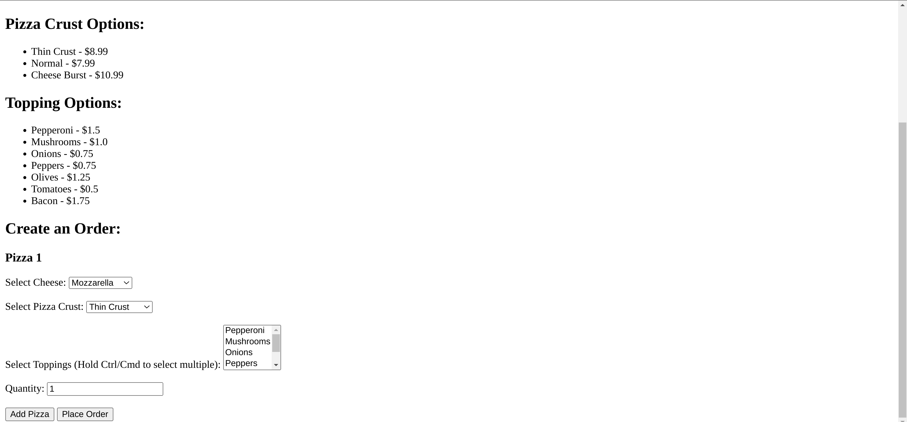
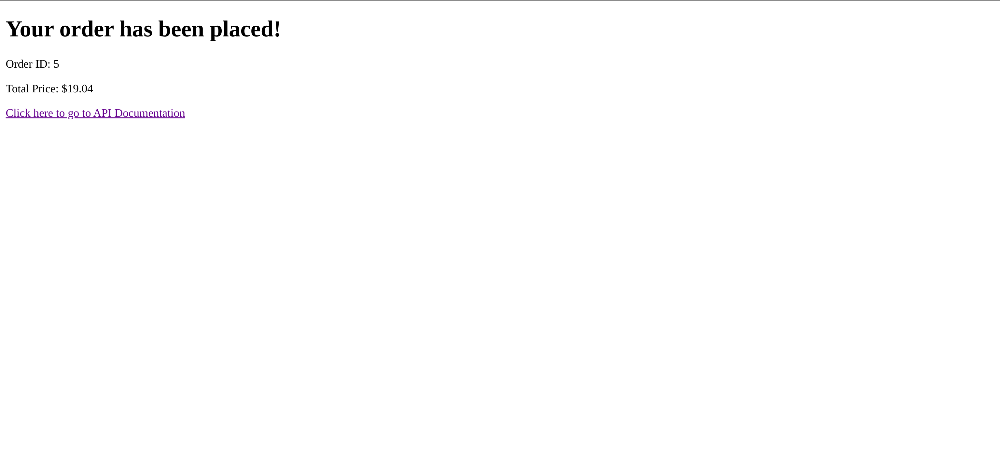
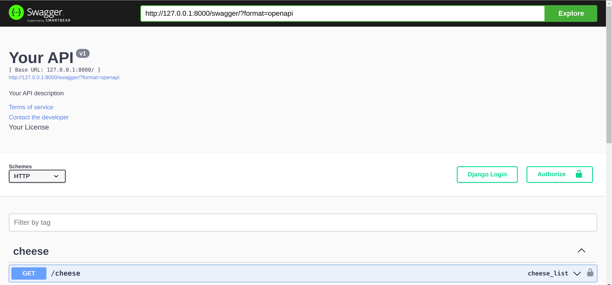
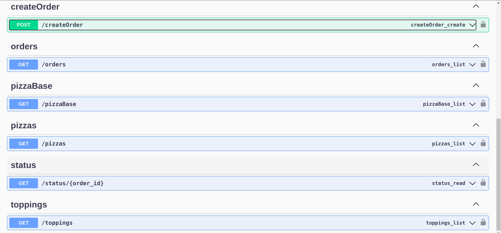

# Pizzeria

This readme file provides instructions on getting started with the app using Docker and some screenshots of the app.

## Prerequisites

Make sure you have the following installed on your system:

- Docker (only required if using Docker): You can download and install Docker from the official website ([https://www.docker.com](https://www.docker.com)).

## Getting Started with Docker

To get started with the app using Docker, follow the steps below:

1. Clone the repository containing the Docker configuration and navigate to its root directory.

2. Open a terminal or command prompt and run the following command to build and start the Docker containers:

   ```
   docker-compose up --build
   ```

   This command will download the necessary Docker images and start the MySQL, server, and run the application.

3. Wait for the containers to start and the necessary dependencies to be installed. You will see logs in the terminal indicating the progress.

4. Once the containers are up and running, you can access the app using the following URLs:

   - HomePage: [http://127.0.0.1:8000](http://127.0.0.1:8000)
   - ApiDocumentation: [http://127.0.0.1:8000/swagger](http://127.0.0.1:8000/swagger)

   The server runs on port 8000.

5. You can now interact with the app through your web browser. The client interface should be accessible at [http://127.0.0.1:8000](http://127.0.0.1:8000).

6. To stop the app and shut down the Docker containers, press `Ctrl + C` in the terminal or command prompt where you started the containers. Docker will gracefully stop the containers and clean up the resources.

## Screenshots

### HomePage




### ApiDocumentation



